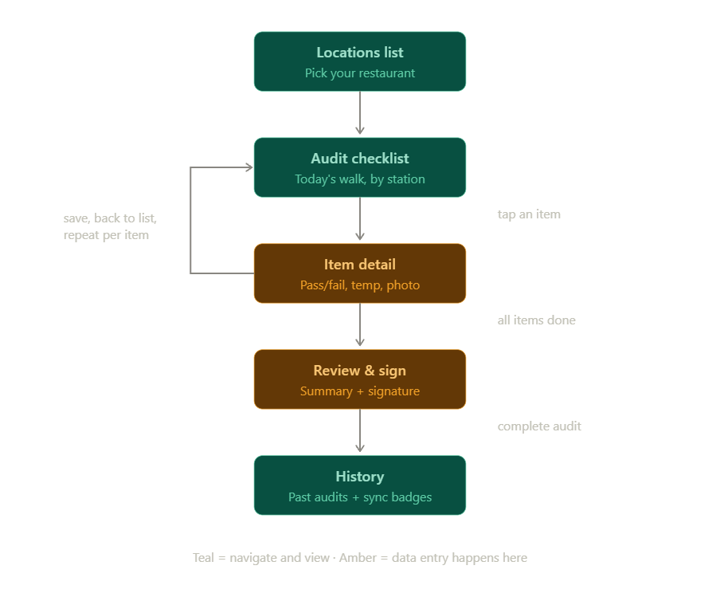

# LineCheck

**A digital clipboard for restaurant food-safety line checks — built to work in the walk-in cooler, where there's no wifi.**

## The problem

Before opening each day, restaurant managers perform a "line check": a station-by-station food-safety walkthrough. Cooler temperatures, prep-line fridges, fryer oil, sanitizer levels — each item is checked, recorded, and signed off, because health inspectors and corporate audits require proof it happened.

Today this mostly happens on paper. Paper gets lost, can't hold photo evidence, and can't be reviewed remotely by a district manager. And the obvious fix — a mobile app — usually fails in the exact place the check happens: a walk-in cooler is a sealed metal box with no connectivity. Any tool that assumes a network connection dies mid-audit.

LineCheck is offline-first by design: every action works instantly with no connection, and the app syncs automatically when the device comes back online.

## How it works

The app mirrors the manager's actual morning walk:

1. **Locations** — Select the restaurant being audited. (Managers and district managers may cover several.)
2. **Audit checklist** — Today's line check, grouped by station (walk-in cooler, prep line, fryers). This is home base during the walk; each item shows its status at a glance.
3. **Item detail** — Standing at a station, the manager records the result: pass/fail, a temperature reading, an optional photo (e.g., a damaged door seal), and notes. Save, and back to the checklist for the next station.
4. **Review & sign** — At the end of the walk: a summary of results and a signature capture. Signing is the compliance moment — the manager's formal attestation that the check was completed.
5. **History** — Past audits with their sync status. An audit completed offline shows as *pending* until connectivity returns, then flips to *synced* — no user action required.

## Offline-first architecture (summary)

All writes go to a local SQLite database immediately — the app is fully functional in airplane mode. Each mutation is also appended to a sync queue, which is flushed to the backend (Supabase) whenever connectivity is detected: audits first, then items, then photo uploads, with retry and backoff. Conflicts resolve last-write-wins on `updatedAt`. Sync state is always visible in the UI rather than hidden.

The demo in one toggle: enable airplane mode, complete an entire audit — checklist, photos, signature — then re-enable wifi and watch the pending badge flip to synced.

