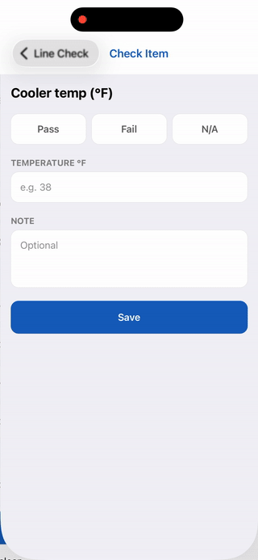
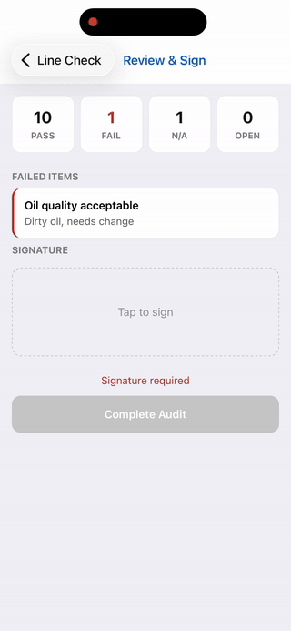
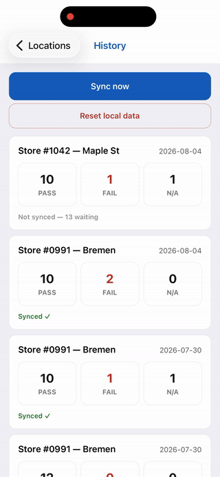
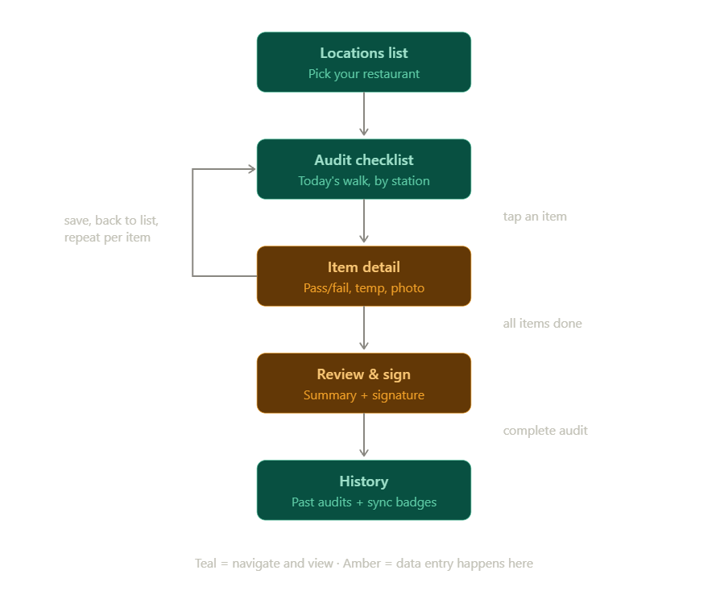
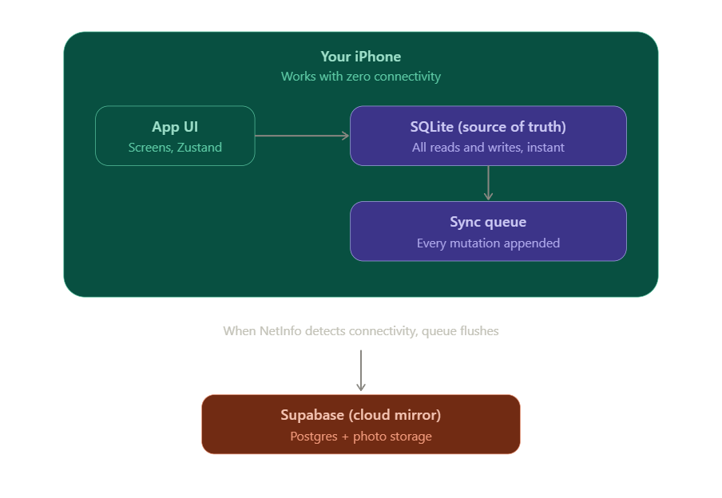

# LineCheck

**A digital clipboard for restaurant food-safety line checks — built to work in the walk-in cooler, where there's no wifi.**

## Demo

| 1 · Record a check | 2 · Review & sign | 3 · Reconnect & sync |
| :---: | :---: | :---: |
|  |  |  |

Left to right: standing at a station, the manager marks the item **Pass**, keys in the cooler temperature, and saves — straight to SQLite, no network involved. At the end of the walk, **Review & sign**: the results tally, failed items called out, and a signature gating the Complete Audit button — no signature, no completed audit. Then History: the audit completed offline sits at *"Not synced — N waiting"* until connectivity returns, and the badge flips to *Synced ✓* as the queue flushes to Supabase.

## The problem

Before opening each day, restaurant managers perform a "line check": a station-by-station food-safety walkthrough. Cooler temperatures, prep-line fridges, fryer oil, sanitizer levels — each item is checked, recorded, and signed off, because health inspectors and corporate audits require proof it happened.

Today this mostly happens on paper. Paper gets lost, can't hold photo evidence, and can't be reviewed remotely by a district manager. And the obvious fix — a mobile app — usually fails in the exact place the check happens: a walk-in cooler is a sealed metal box with no connectivity. Any tool that assumes a network connection dies mid-audit.

LineCheck is offline-first by design: every action works instantly with no connection, and the app syncs automatically when the device comes back online.

## How it works

The app mirrors the manager's actual morning walk:

1. **Locations** — Select the restaurant being audited. (Managers and district managers may cover several.)
2. **Audit checklist** — Today's line check, grouped by station (walk-in cooler, prep line, fryers). This is home base during the walk; each item shows its status at a glance.
3. **Item detail** — Standing at a station, the manager records the result: pass / fail / N/A, a temperature reading where the item requires one, and an optional note. Save, and back to the checklist for the next station.
4. **Review & sign** — At the end of the walk: a summary of results and a full-screen signature capture. Signing is the compliance moment — the manager's formal attestation, saved as a PNG. It's required: an audit can't be completed without it.
5. **History** — Past audits with their sync status. An audit completed offline shows as *pending* until connectivity returns, then flips to *synced* — no user action required. Opening one shows the complete signed record: every station's results with the signature underneath, matching the paper form it replaces.

## Offline-first architecture

All writes go to a local SQLite database immediately — the app is fully functional in airplane mode. Completing an audit appends snapshot rows to a sync queue (the outbox pattern), which a small two-state engine (`idle | syncing`) flushes to the backend (Supabase) at three moments: when connectivity returns, when an audit is completed, and on a manual Sync now tap. The flush uploads each audit's signature PNG to a Storage bucket first (so a synced row never references a missing image), then pushes audits, then items, keyed on client-generated UUIDs so re-runs merge instead of duplicating — the signature upload overwrites a deterministic path for the same reason. There is deliberately no retry counter or backoff: a failed push leaves the queue intact, and the next natural trigger simply tries again. Conflicts resolve last-write-wins on `updatedAt`. Sync state is always visible in the UI rather than hidden.

The screens, and how the manager moves through them:



How a completed audit reaches the backend — the outbox, the sync engine's three triggers, and the flush order:



## Tested where it counts

50 test cases across 6 suites, all runnable with `npm test` — no device or emulator needed:

- **Flush worker** — pushes in FK order (signature upload → audits → items), re-runs are idempotent, a crash mid-flush recovers cleanly, and a failed batch stays queued.
- **Sync engine** — the offline→online edge triggers exactly one sync, steady-state connectivity events don't, offline pokes are no-ops, and an in-flight push can't be double-run.
- **Validation** — the Zod gates that keep bad data out of the queue: no blank results, temperatures required where the item demands one, no completing an unsigned audit.
- **Sync badge derivation, error formatting, and the test adapter itself.**

The trick that makes this possible: a `better-sqlite3` in-memory adapter runs the app's real SQL — same migrations, same queries — inside Node, so all the database and sync logic is exercised without a device. The stance is deliberate: logic gets unit tests; UI gets tested on-device and belongs to a real E2E driver at production scale, not brittle component snapshots.

## Design decisions

Every non-obvious tradeoff is logged in [DECISIONS.md](./DECISIONS.md) with a date, the rationale, and the alternatives considered — including the ones that got *removed*: the retry counter and backoff scheduler were built, then deliberately deleted in favor of "every trigger re-attempts the whole queue" (the reasoning is in the known-limitations story below). Other entries cover why only completed audits are enqueued (draft edits stay local), why sync state is a separate query instead of a join, and the storage-security posture.

## Stack & running it

Expo SDK 54 (Expo Go compatible — no custom native code) · TypeScript strict · Expo Router · expo-sqlite (source of truth) · Supabase (remote mirror + Storage) · Zustand · Reanimated · react-native-signature-canvas.

```bash
npm install
# .env: EXPO_PUBLIC_SUPABASE_URL=... and EXPO_PUBLIC_SUPABASE_ANON_KEY=...
# One-time Supabase setup:
#   1. apply supabase/schema.sql — the tables (a transcript of the remote
#      contract; safe to run against a fresh project)
#   2. in the dashboard: create a public "signatures" Storage bucket (1MB cap,
#      image/png only) with anon insert/update/select policies — see
#      DECISIONS.md 2026-07-30 for why all three
#   3. seed `locations` and `checklist_templates` — the app provisions its
#      local checklist FROM the remote on first run, so empty seed tables
#      mean an empty Locations screen
npx expo start   # scan the QR with Expo Go on a phone
npm test         # the full suite, no device needed
```

## Known limitations (deliberate)

**One poisoned row can block the whole sync batch.** The flush is all-or-nothing: every pending audit goes up in one batched upsert, then every item in a second. If the server permanently rejects a single row — a schema mismatch, a constraint violation — that request fails, and nothing syncs until the underlying bug is fixed (at which point the entire queue drains on the next trigger with no user action). This isn't hypothetical: an early schema-drift bug (`signature_uri` vs. the remote's `signature_path`) blocked every sync exactly this way, and finding it is why flush errors are now loudly surfaced instead of swallowed.

This weakness is accepted rather than fixed, twice over:

- An earlier design quarantined failing rows after three attempts so later audits could sync around them. It was removed on purpose: the counter never explained *why* something failed, quarantined rows required a manual reset even after the underlying bug was fixed, and poison sources are rare here — a single-writer backend plus client-side Zod validation ahead of every enqueue.
- The production-scale remedy is known and named: **fail-then-split bisection**. On a batch failure, split the batch in half and retry each half, recursively — isolating a bad row in about 2·log₂(n) requests while healthy rows still land. It needs only one bit per request ("did this batch fail"), so it works without parsing server error strings, and it distinguishes one bad row from a systemic outage for free. Doing it right also means: never bisect a *network* throw (only a server rejection), skip the split on batch-level error codes (bad column, RLS denial — splitting can't help), and mark an audit synced only when its own row *and* all its items have landed. That's out of scope for this POC — but it's the first thing I'd build at production scale.

**Storage is deliberately permissive.** Signature PNGs upload to a public-read Supabase bucket under policies that let the app's anon key insert, overwrite, and list — the same "no auth in the POC" posture as the RLS-off tables. (The list/select policy isn't generosity: the storage API's upsert path requires the object row to be visible, a fact isolated the hard way and recorded in DECISIONS.) The exposure is bounded on purpose: object paths are built from client-generated UUIDs (unguessable, unenumerable — capability URLs), the bucket caps files at 1MB and accepts only `image/png`, and only demo data is ever signed. At production scale this becomes a private bucket, authenticated per-user policies, and signed URLs for reads.

**Deliberately out of scope (for now):**

- **Photo capture.** The data layer already carries it (`photoUri` locally, `photo_path` in the remote schema) and the flush is designed to grow a third request type for it, exactly like the signature upload — but there is no camera UI yet. Cut to keep the vertical slice tight; the signature arc proves the same capture→upload→display pipeline end to end.
- **Auth.** No sign-in in the POC; IDs are client-generated UUIDs so offline creation never blocks on a server. Authentication and per-user RLS are the first additions at production scale.
